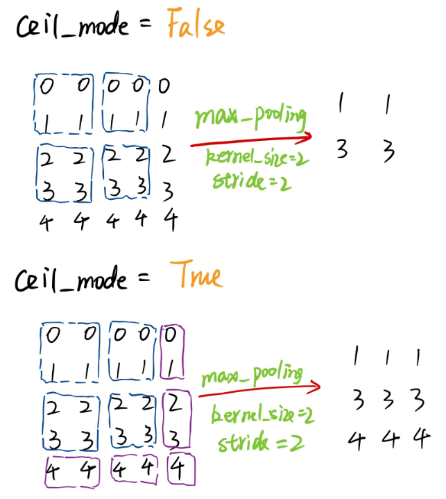

###### PyTorch中MaxPool的ceil_mode属性

---
PyTorch中的MaxPool（最大池化）有一个属性：ceil_mode，默认为False（地板模式），为True时是天花板模式。
```python
class torch.nn.MaxPool1d(kernel_size, stride=None, padding=0, 
            dilation=1, return_indices=False, ceil_mode=False)
```
<!-- 
 -->
<div align = 'center'>

</div>
